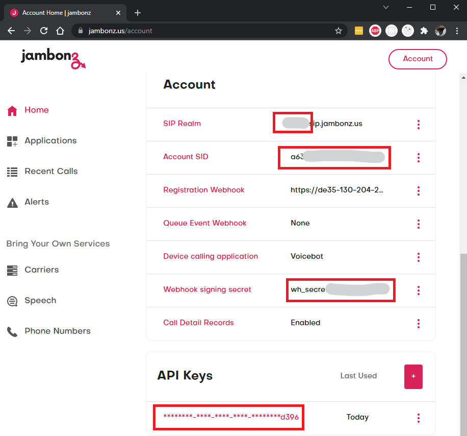
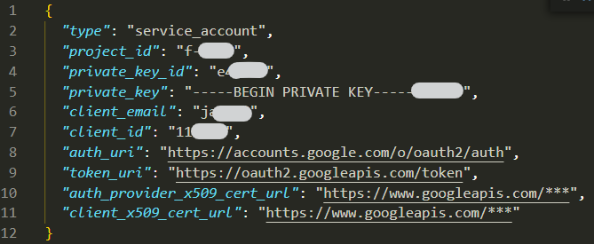

# ut-port-jambonz

## Properties

Use the screenshots below to define the following properties:

* Bot properties
  * `platform` - set to 'jambonz'
  * `appId` - use the `Account SID`, highlighted in the screenshot
  * `secret` - use `Webhook signing secret`, highlighted in the screenshot
  * `verifyToken` - use one of the `API Keys`, highlighted in the screenshot
  * `profile` - contains these additional properties:
    * `inbound` - the name of the context to use for handling inbound calls.
    * `realm` - the prefix for the `SIP realm`.
* Context properties
  * `clientId` - set to any string
  * `accessToken` - set as empty string
  * `name` - same as `profile.inbound` bot property
  * `profile` - contains these additional properties:
    * `type` - set to 'Application'

To enable automatic configuration of speech credentials, the following
additional contexts can be defined for each bot:

* For *Google Cloud Speech*:
  Create a service account and a key, then use it to set
  these properties in the context:
  * `clientId` - use the `client_email` from the service account key file
  * `accessToken` - use the `private_key` from the service account key file
  * `profile` - contains these additional properties:
    * `speechVendor` - set to 'google'
    * `project_id` - use the `project_id` from the service account key file
    * `private_key_id` - use the `private_key_id` from the service account key file
    * `client_id` - use the `client_id` from the service account key file
    * `client_x509_cert_url` - use the `client_x509_cert_url` from the service
    account key file

